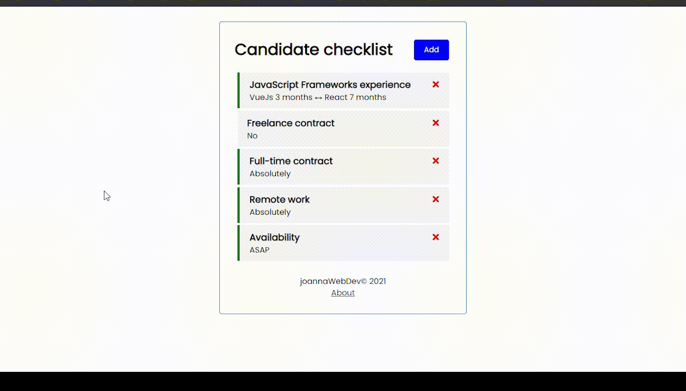

# Interview checklist Vue3   
--- 

Here I answer some of the more general questions that you as a recruiter might have for me.  

## Quick peek  

<p>
  
</p>


## Project setup

```
npm install
```

## Run the JSON-Server backend (http://localhost:5000)

```
npm run backend
```

## Run the Vue dev server (http://localhost:8080)

```
npm run serve
```

## Compiles and minifies for production

```
npm run build
```


